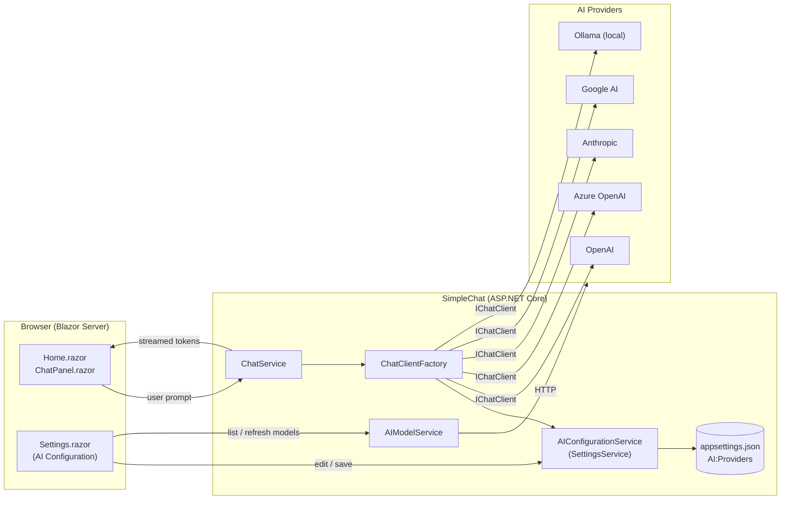
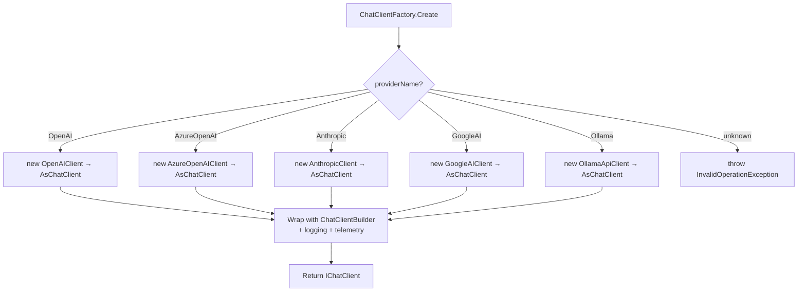
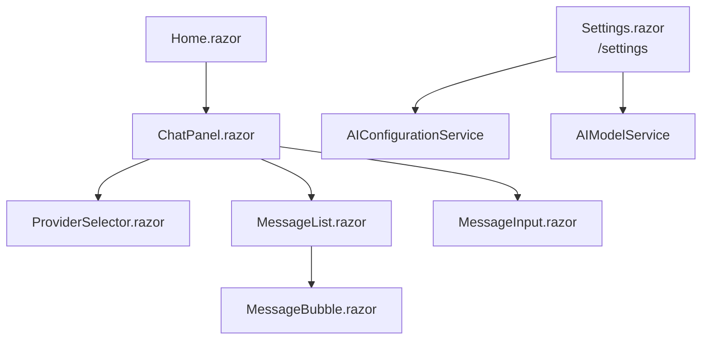
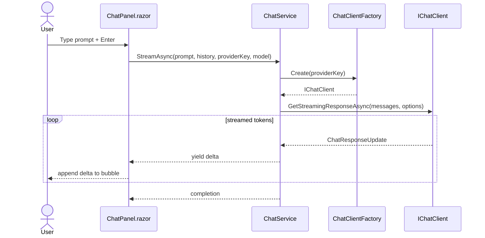
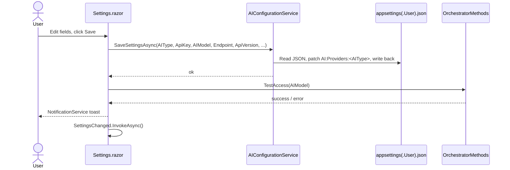

# SimpleChat – Home Page Chat Feature Implementation Plan

This document describes a structured, developer‑ready plan for adding a chat experience to the `SimpleChat` Blazor application. The implementation reuses the AI configuration model and chat UI patterns from the **AIStoryBuildersOnline** project (`C:\Users\Administrator\source\repos\AIStoryBuilders\AIStoryBuildersOnline`) and persists every provider's settings in `appsettings.json`.

---

## 1. Goals

1. Replace the placeholder content of `Components/Pages/Home.razor` with a fully functional chat interface.
2. Port the AI configuration abstractions and the chat UI components from **AIStoryBuildersOnline** into SimpleChat.
3. Store configuration for **all** supported AI providers (OpenAI, Azure OpenAI, Anthropic, Google AI, Ollama, etc.) in `appsettings.json`, selectable at runtime.
4. Provide a dedicated **AI Configuration screen** (ported from AIStoryBuildersOnline `Components/Pages/Settings.razor`) so that the API key, endpoint, model list, API version, and active provider can be edited from the UI and persisted back to `appsettings.json`.
5. Keep the implementation aligned with .NET 10 Aspire conventions already used in the repo (`SimpleChat.AppHost`, `SimpleChat.ServiceDefaults`).

---

## 2. High‑Level Architecture



### Component Responsibilities

| Component | Responsibility |
|-----------|----------------|
| `Home.razor` | Hosts the chat page, wires DI, renders `<ChatPanel>`. |
| `Settings.razor` | AI Configuration screen (ported from AIStoryBuildersOnline). Lets the user pick a provider, enter API key/endpoint/version, browse and refresh available models, and persist values to `appsettings.json` via `AIConfigurationService`. |
| `ChatPanel.razor` | Radzen‑based UI: message list, input box, provider/model selector, streaming display. |
| `ChatService` | Maintains conversation state, calls `IChatClient`, streams responses. |
| `AIConfigurationService` | Loads/validates the `AI` section of `appsettings.json`, exposes typed options per provider, and writes user edits back to disk. |
| `AIModelService` | Calls each provider's `/models` endpoint to fetch the current list of models for the configuration screen. Falls back to a hard‑coded default list per provider on error. |
| `ChatClientFactory` | Creates an `IChatClient` (Microsoft.Extensions.AI) from the active provider's settings. |

---

## 3. Source Reuse from AIStoryBuildersOnline

The following assets will be copied (and renamed where appropriate) from `AIStoryBuildersOnline` and adapted to SimpleChat namespaces:

| Source (AIStoryBuildersOnline) | Destination (SimpleChat) | Notes |
|--------------------------------|--------------------------|-------|
| `Services/AIConfiguration*.cs`, `Services/SettingsService.cs` | `SimpleChat/Services/AI/AIConfigurationService.cs` | Strip story‑builder specifics; keep provider model and JSON read/write of `appsettings.json`. |
| `Services/AIModelService.cs` | `SimpleChat/Services/AI/AIModelService.cs` | Port verbatim; exposes `GetModelsAsync`, `RefreshModelsAsync`, `GetDefaultModels` per provider. |
| `Services/OrchestratorMethods` (chat parts) | `SimpleChat/Services/AI/ChatService.cs` | Keep only `ChatAsync` / streaming / `TestAccess` logic. |
| `Components/Pages/Settings.razor` | `SimpleChat/Components/Pages/Settings.razor` | AI Configuration screen — see §7.5. |
| `Components/Chat/*.razor` (chat bubble, input, list) | `SimpleChat/Components/Chat/` | Replace any story-specific bindings with generic chat models. |
| `Models/ChatMessage.cs`, `AIProviderSettings.cs` | `SimpleChat/Models/` | Used by both UI and services. |
| Radzen styling overrides | `SimpleChat/wwwroot/app.css` | Append; do not overwrite. |

> **Note:** Do not copy code that depends on AIStoryBuilders' database, storage, or domain entities. The chat in SimpleChat is stateless beyond the in‑memory conversation.

---

## 4. Configuration Model (`appsettings.json`)

All providers live under a single `AI` root section. The `ActiveProvider` key chooses which one is used by default; the UI may override it per session.

```json
{
  "AI": {
    "ActiveProvider": "OpenAI",
    "Providers": {
      "OpenAI": {
        "Enabled": true,
        "ApiKey": "sk-...",
        "Endpoint": "https://api.openai.com/v1",
        "DefaultModel": "gpt-4o-mini",
        "Models": [ "gpt-4o-mini", "gpt-4o", "o4-mini" ]
      },
      "AzureOpenAI": {
        "Enabled": false,
        "ApiKey": "",
        "Endpoint": "https://<resource>.openai.azure.com/",
        "DeploymentName": "gpt-4o",
        "ApiVersion": "2024-10-21",
        "Models": [ "gpt-4o", "gpt-4o-mini" ]
      },
      "Anthropic": {
        "Enabled": false,
        "ApiKey": "",
        "Endpoint": "https://api.anthropic.com",
        "DefaultModel": "claude-sonnet-4-20250514",
        "Models": [ "claude-sonnet-4-20250514", "claude-3-5-haiku-latest" ]
      },
      "GoogleAI": {
        "Enabled": false,
        "ApiKey": "",
        "Endpoint": "https://generativelanguage.googleapis.com",
        "DefaultModel": "gemini-2.5-flash",
        "Models": [ "gemini-2.5-flash", "gemini-2.5-pro" ]
      },
      "Ollama": {
        "Enabled": true,
        "Endpoint": "http://localhost:11434",
        "DefaultModel": "llama3.1",
        "Models": [ "llama3.1", "qwen2.5", "phi4" ]
      }
    },
    "Defaults": {
      "Temperature": 0.7,
      "MaxOutputTokens": 1024,
      "SystemPrompt": "You are a helpful assistant."
    }
  }
}
```

### Strongly‑Typed Options

```csharp
public sealed class AIOptions
{
    public string ActiveProvider { get; set; } = "OpenAI";
    public Dictionary<string, ProviderOptions> Providers { get; set; } = new();
    public ChatDefaults Defaults { get; set; } = new();
}

public sealed class ProviderOptions
{
    public bool Enabled { get; set; }
    public string? ApiKey { get; set; }
    public string? Endpoint { get; set; }
    public string? DefaultModel { get; set; }
    public string? DeploymentName { get; set; }   // Azure only
    public string? ApiVersion { get; set; }       // Azure only
    public List<string> Models { get; set; } = new();
}

public sealed class ChatDefaults
{
    public float Temperature { get; set; } = 0.7f;
    public int MaxOutputTokens { get; set; } = 1024;
    public string SystemPrompt { get; set; } = "You are a helpful assistant.";
}
```

Bound in `Program.cs`:

```csharp
builder.Services.AddOptions<AIOptions>()
    .Bind(builder.Configuration.GetSection("AI"))
    .ValidateDataAnnotations()
    .ValidateOnStart();
```

> **Secrets:** Never commit real keys. Use `dotnet user-secrets` in development and environment variables (or Azure Key Vault) in production. Keys in `appsettings.json` should be empty placeholders.

---

## 5. NuGet Dependencies

Add to `SimpleChat/SimpleChat.csproj`:

| Package | Purpose |
|---------|---------|
| `Microsoft.Extensions.AI` | Common `IChatClient` abstraction. |
| `Microsoft.Extensions.AI.OpenAI` | OpenAI provider. |
| `Azure.AI.OpenAI` | Azure OpenAI client. |
| `OllamaSharp` | Ollama provider (`IChatClient` adapter). |
| `Markdig` | Render markdown chat output. |

Radzen.Blazor is already referenced.

---

## 6. ChatClientFactory

Encapsulates the conditional construction of `IChatClient`.



Key rules:

* The factory throws if `Enabled == false` for the requested provider.
* OpenTelemetry is wired through `ChatClientBuilder.UseOpenTelemetry()` to plug into the existing `SimpleChat.ServiceDefaults` observability stack.

---

## 7. Chat UI

### 7.1 Component Tree



### 7.2 `Home.razor`

```razor
@page "/"
@using SimpleChat.Components.Chat

<PageTitle>SimpleChat</PageTitle>

<RadzenStack Orientation="Orientation.Vertical" Gap="0.5rem" Style="height: calc(100vh - 80px);">
    <h1 class="rz-mb-0">SimpleChat</h1>
    <ChatPanel />
</RadzenStack>
```

### 7.3 `ChatPanel.razor` Behavior

* Injects `ChatService`, `IOptionsMonitor<AIOptions>`.
* On first render, populates the provider/model dropdowns from `AIOptions.Providers` (only `Enabled == true`).
* Maintains an `ObservableCollection<ChatMessage>` bound to `MessageList`.
* Submits user messages via `ChatService.StreamAsync(...)`, appending streamed deltas into the last assistant bubble for live typing effect.
* Renders assistant text through Markdig (sanitize HTML).

### 7.4 Conversation Flow



### 7.5 `Settings.razor` – AI Configuration Screen

A new page at route `/settings`, ported from AIStoryBuildersOnline's `Components/Pages/Settings.razor`. It is the single place where the user manages every provider's credentials and chosen model. All edits are persisted by `AIConfigurationService` back into `appsettings.json` (Development) or, in production, into a writable JSON overlay (`appsettings.User.json`) so secrets never need to be redeployed.

#### 7.5.1 Feature Parity with AIStoryBuildersOnline

The screen ports **every** behavior present in the source `Settings.razor`:

| Feature | Description |
|---------|-------------|
| **AI Service Type dropdown** | `RadzenDropDown` of `OpenAI`, `Azure OpenAI`, `Anthropic`, `Google AI`, `Ollama` (Ollama added for SimpleChat). Bound to `AIType`. |
| **Change handler** | `ChangeAIType` resets the default model per provider (`gpt-5-mini`, `claude-sonnet-4-20250514`, `gemini-2.5-flash`, blank for Azure deployment name) and reloads the model list. |
| **API Key textbox** | `RadzenTextBox` bound to `ApiKey`; `@onkeydown` flips `IsSettingsEntered = true` to reveal the **Save** button. |
| **Azure-only fields** | When `AIType == "Azure OpenAI"`, render `Endpoint` and `ApiVersion` textboxes. |
| **Model dropdown** | `RadzenDropDown` with `AllowFiltering`, `AllowClear`, case-insensitive filter, `Placeholder="Select or type a model..."`. Label is dynamic (`ModelFieldLabel`): "Default AI Model:", "Azure OpenAI Model Deployment Name:", "Anthropic Model:", "Google AI Model:". |
| **Refresh models button** | `RadzenButton` with `refresh` icon next to the model dropdown; calls `AIModelService.RefreshModelsAsync(AIType, ApiKey, Endpoint)`. Shows `IsBusy` spinner. |
| **Loading caption** | While `isLoadingModels` is true, render *"Loading available models..."* with an hourglass icon. |
| **Get-API-Key helper buttons** | Shown when `IsSettingsEntered == false`, one per provider, each opening the relevant URL via `JSRuntime.InvokeVoidAsync("open", ...)`: <br/>• OpenAI → `https://platform.openai.com/account/api-keys` <br/>• Azure OpenAI → `https://learn.microsoft.com/en-us/azure/ai-services/openai/how-to/create-resource?pivots=web-portal` <br/>• Anthropic → `https://console.anthropic.com/settings/keys` <br/>• Google AI → `https://aistudio.google.com/app/apikey` |
| **Save button** | Visible once an API key is entered. Validates (e.g., OpenAI keys must start with `sk-`), then calls `AIConfigurationService.SaveSettingsAsync(...)` and `OrchestratorMethods.TestAccess(AIModel)` to verify connectivity. |
| **Notifications** | `NotificationService` toasts for *Saved*, *Models refreshed*, *API Key required*, *Refresh failed*, *Invalid API Key*, and arbitrary exception messages — same severities and durations as the source. |
| **SettingsChanged callback** | `[Parameter] EventCallback SettingsChanged` raised after a successful save so the chat UI can re-bind to the new active provider. |
| **Initial load** | `OnInitializedAsync` reads the current values from `AIConfigurationService`, sets `IsSettingsEntered` based on whether `ApiKey.Length > 1`, then calls `LoadModelsAsync`. |

#### 7.5.2 Layout (Razor sketch)

```razor
@page "/settings"
@inherits OwningComponentBase
@inject NotificationService NotificationService
@inject DialogService DialogService
@inject AIConfigurationService SettingsService
@inject AIModelService AIModelService
@inject IJSRuntime JSRuntime

<h3>Settings</h3>

<RadzenRow AlignItems="AlignItems.Start" Wrap="FlexWrap.Wrap" Gap="1rem" Class="rz-p-sm-12">
    <RadzenColumn Size="8" SizeSM="4">
        <RadzenStack>
            <RadzenFormField Text="AI Service Type:" Variant="@variant">
                <RadzenDropDown Data="@colAITypes" @bind-Value="@AIType"
                                Style="width:300px"
                                Change="@(args => ChangeAIType(args))" />
            </RadzenFormField>

            <RadzenFormField Text="ApiKey:" Variant="@variant">
                <RadzenTextBox @bind-Value="@ApiKey"
                               @onkeydown="APIKeyDetection"
                               style="width:450px;" />
            </RadzenFormField>

            @if (AIType == "Azure OpenAI")
            {
                <RadzenFormField Text="Azure OpenAI Endpoint:" Variant="@variant">
                    <RadzenTextBox @bind-Value="@Endpoint" style="width:450px;" />
                </RadzenFormField>
                <RadzenFormField Text="Azure OpenAI Api Version:" Variant="@variant">
                    <RadzenTextBox @bind-Value="@ApiVersion" style="width:450px;" />
                </RadzenFormField>
            }

            <RadzenFormField Text="@ModelFieldLabel" Variant="@variant">
                <RadzenStack Orientation="Orientation.Horizontal" Gap="4" AlignItems="AlignItems.Center">
                    <RadzenDropDown Data="@availableModels" @bind-Value="@AIModel"
                                    Style="width:350px;"
                                    AllowFiltering="true"
                                    FilterCaseSensitivity="FilterCaseSensitivity.CaseInsensitive"
                                    AllowClear="true"
                                    Placeholder="Select or type a model..." />
                    <RadzenButton Icon="refresh"
                                  ButtonStyle="ButtonStyle.Light"
                                  Size="ButtonSize.Small"
                                  Click="@RefreshModels"
                                  IsBusy="@isLoadingModels"
                                  title="Refresh models from API" />
                </RadzenStack>
            </RadzenFormField>

            @if (isLoadingModels)
            {
                <RadzenText TextStyle="TextStyle.Caption" Style="color:#6b7280;">
                    <RadzenIcon Icon="hourglass_empty" Style="font-size:14px;" />
                    Loading available models...
                </RadzenText>
            }

            @if (!IsSettingsEntered)
            {
                @* Get-API-Key helper buttons (one per provider) *@
            }
            else
            {
                <RadzenButton Text="Save" ButtonStyle="ButtonStyle.Primary"
                              Click="SettingsSave"
                              Style="margin-bottom:10px;width:500px" />
            }
        </RadzenStack>
    </RadzenColumn>
</RadzenRow>
```

#### 7.5.3 Code-behind responsibilities

```csharp
[Parameter] public EventCallback SettingsChanged { get; set; }

string AIType = "OpenAI";
string ApiKey = "", Endpoint = "", ApiVersion = "", AIModel = "gpt-5-mini";
List<string> colAITypes = new() { "OpenAI", "Azure OpenAI", "Anthropic", "Google AI", "Ollama" };
List<string> availableModels = new();
bool isLoadingModels;
bool IsSettingsEntered;

string ModelFieldLabel => AIType switch
{
    "Azure OpenAI" => "Azure OpenAI Model Deployment Name:",
    "Anthropic"   => "Anthropic Model:",
    "Google AI"   => "Google AI Model:",
    _             => "Default AI Model:"
};
```

The methods `OnInitializedAsync`, `LoadModelsAsync`, `RefreshModels`, `ChangeAIType`, `APIKeyDetection`, `GetAPIKey` / `GetAzureAPIKey` / `GetAnthropicAPIKey` / `GetGoogleAPIKey`, and `SettingsSave` are ported with identical signatures and behavior, swapping AIStoryBuilders' `SettingsService` for SimpleChat's `AIConfigurationService`.

#### 7.5.4 Persistence Flow



#### 7.5.5 Navigation

A "Settings" link is added to `Components/Layout/NavMenu.razor` pointing to `/settings`, plus a gear icon button in the top-right of `ChatPanel.razor` for quick access.

---

## 8. Service Registration (`Program.cs`)

```csharp
builder.Services.AddOptions<AIOptions>()
    .Bind(builder.Configuration.GetSection("AI"));

builder.Services.AddSingleton<ChatClientFactory>();
builder.Services.AddSingleton<AIConfigurationService>();
builder.Services.AddHttpClient<AIModelService>();
builder.Services.AddScoped<ChatService>();

builder.Services.AddRadzenComponents();
```

No changes are required in `SimpleChat.AppHost` unless an Ollama container is added; in that case:

```csharp
var ollama = builder.AddOllama("ollama")
                    .WithDataVolume()
                    .AddModel("llama3.1");

builder.AddProject<Projects.SimpleChat>("web")
       .WithReference(ollama);
```

---

## 9. Error Handling & UX

| Scenario | Behavior |
|----------|----------|
| Provider disabled | Hide from selector; show toast if forced via URL. |
| Missing API key | `AIConfigurationService` returns validation errors; UI shows banner. |
| Streaming exception | Catch in `ChatService`, surface as a system bubble with retry button. |
| Long output | Auto‑scroll to bottom; cancel via `CancellationTokenSource` tied to a "Stop" button. |

---

## 10. Implementation Steps (Checklist)

1. **Models** – Add `ChatMessage`, `AIOptions`, `ProviderOptions`, `ChatDefaults` under `SimpleChat/Models`.
2. **Config** – Update `appsettings.json` and `appsettings.Development.json` with the schema in §4 (placeholders only).
3. **Packages** – Add NuGet references from §5.
4. **Services** – Port `AIConfigurationService` (with read/write JSON support), `AIModelService`, implement `ChatClientFactory`, port/trim `ChatService`.
5. **DI** – Register options + services in `Program.cs`.
6. **Chat UI** – Create `Components/Chat/{ChatPanel,MessageList,MessageBubble,MessageInput,ProviderSelector}.razor` (port from AIStoryBuildersOnline).
7. **Settings UI** – Port `Components/Pages/Settings.razor` from AIStoryBuildersOnline as described in §7.5; wire `/settings` route and add NavMenu link.
8. **Home** – Replace `Home.razor` body with `<ChatPanel />`.
9. **Styling** – Append Radzen tweaks to `wwwroot/app.css`.
10. **Telemetry** – Plug `UseOpenTelemetry` into the chat pipeline.
11. **Smoke Test** – Start AppHost, edit each provider in `/settings`, save, then send a prompt against each enabled provider.

---

## 11. Out of Scope (Future Work)

* Persisting conversations to a database.
* Authentication / per‑user history.
* Tool calling / function execution.
* File and image attachments.
* Automated unit/integration test suite (intentionally omitted from this plan).

---

## 12. References

* AIStoryBuildersOnline source – `C:\Users\Administrator\source\repos\AIStoryBuilders\AIStoryBuildersOnline`
* Microsoft.Extensions.AI documentation – <https://learn.microsoft.com/dotnet/ai/>
* Radzen Blazor components – <https://blazor.radzen.com/>
* .NET Aspire – <https://learn.microsoft.com/dotnet/aspire/>
